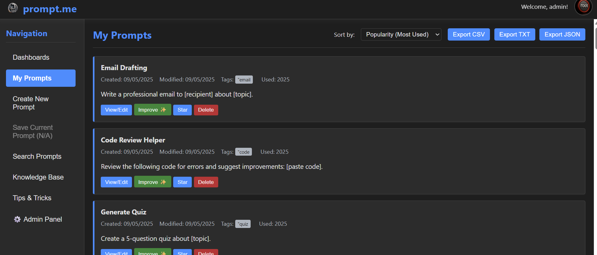

# prompt.me - MVP

A client-side web application for managing AI prompts. This is an MVP built with HTML, CSS, and vanilla JavaScript, storing data in `localStorage`.

## Project From: Application Development Lifecycle Document (ADLD)
- **Project Title:** prompt.me
- **Company:** Private
- **Prepared By:** Jestie (Conceptual) / AI Assisted
- **Version:** 1.0 (Client-Side MVP)

## Features (MVP)
- Simulated MFA login
- Create, View, Edit, Delete Prompts
- Star/Unstar Prompts
- Sort Prompts (Date, Tag (basic), Popularity (simulated), Alphabetical)
- Data persistence via browser `localStorage`
- Basic User Profile & Settings stubs

## How to Run
1. Clone or download the repository.
2. Place on a local Web Server, or just run "npx live-server" on a port, and connect, to http(s)://my_local_server/index.html
3. By just opening the index.html file on a browser, without using a server will not work. 
4. Ensure all files (`index.html`, `style.css`, `script.js`, and `J_dev.png`) are in the same directory.
5. Open `index.html` in a modern web browser (e.g., Chrome, Firefox, Edge).

## Default Login Credentials (Simulated)
**Option 1:**
- Username: `user`
- Password: `password123`
- MFA Code: `123456`

**Option 2:**
- Username: `admin`
- Password: `secure`
- MFA Code: `654321`

## Future Development Goals
- Integration with a proper backend (Node.js/Express, PostgreSQL as per ADLD).
- Real MFA implementation (e.g., Auth0).
- Cloud storage for prompts.
- Advanced analytics.
- And more features are outlined in the TODO.md.

## Tech Stack (MVP)
- HTML5
- CSS3 (Flexbox for layout)
- Vanilla JavaScript (ES6+)

### 📸 App Preview

